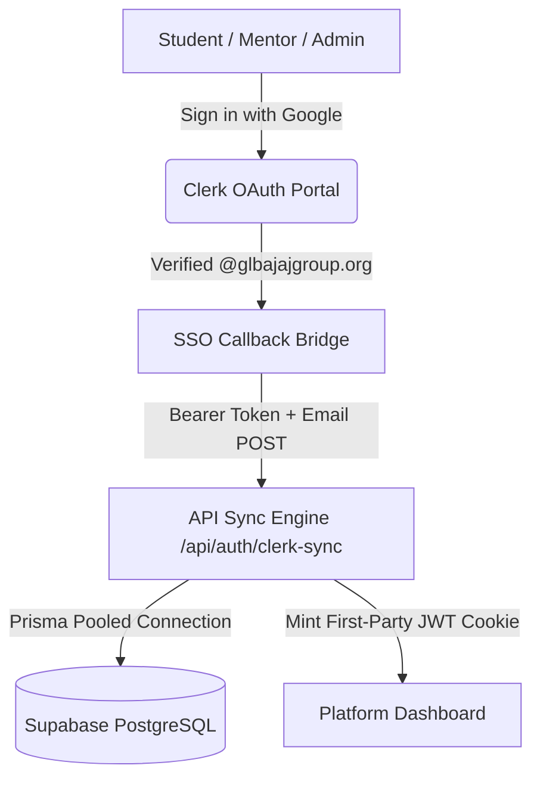

# SIH@GLBGOI Platform — Engineering Walkthrough & Changelog

**Target Audience:** Co-founders, Tech Leads, and Engineering Team  
**Deployment Status:** Live on Vercel (`https://sih-glbgoi.vercel.app`)  
**CI/CD Status:** All 4 GitHub Actions Check Suites Passing Green (57/57 Tests Passing)

---

## 1. Executive Summary

This release resolves the Google OAuth authentication flow, establishes a bulletproof client-to-server token synchronization bridge, hardens domain security to official `@glbajajgroup.org` accounts, fixes all CI/CD pipelines, and enhances the Admin Console with accordion theme views and full profile deletion capabilities.



---

## 2. Authentication & Security Fixes

### A. Resolution of `oauth_failed` on Vercel
* **The Root Cause:** In development mode (`clerk.accounts.dev`), Google Chrome restricts cross-domain cookies when redirecting back to `sih-glbgoi.vercel.app`. On top-level `GET` redirects, the server received no session cookies, causing `auth()` to return `null` and trigger `oauth_failed`.
* **The Solution:** Implemented a **Direct Client-to-Server Token Bridge**:
  1. [`src/app/sso-callback/page.tsx`](file:///d:/Github/SIH-2026/src/app/sso-callback/page.tsx) intercepts the redirect via `clerk.handleRedirectCallback({}, async () => { ... })`.
  2. Extracts the verified session token directly from browser memory.
  3. Sends a `POST` request to `/api/auth/clerk-sync` with `Authorization: Bearer <token>`.
  4. [`src/app/api/auth/clerk-sync/route.ts`](file:///d:/Github/SIH-2026/src/app/api/auth/clerk-sync/route.ts) validates the token using `@clerk/backend` `verifyToken`, creates/updates the database record in Supabase, mints a secure first-party session cookie, and routes to `/dashboard`.

### B. Strict Domain Restriction
* Exclusively permits official college workspace accounts (`@glbajajgroup.org`).
* Personal accounts (`@gmail.com`) and external domains are blocked on both frontend and backend with a clear *"Access Restricted"* prompt.

### C. Direct 1-Click Google OAuth
* Replaced URL hash manipulation with direct `clerk.client.signIn.authenticateWithRedirect({ strategy: 'oauth_google', continueSignUp: true })` in [`src/app/(auth)/login/page.tsx`](file:///d:/Github/SIH-2026/src/app/(auth)/login/page.tsx), immediately opening the Google account picker.

---

## 3. CI/CD & Build Pipeline Hardening

* **Prisma Migrations in CI:** Created [`scripts/build.mjs`](file:///d:/Github/SIH-2026/scripts/build.mjs) to deploy migrations when a live database is present, while cleanly skipping them during CI pre-build checks without failing the build.
* **Linux Runner Compatibility:** Switched build runner execution to `npx next build` for cross-platform binary resolution on Ubuntu GitHub Actions runners.
* **GitHub Actions Environment Configuration:** Updated [`.github/workflows/ci.yml`](file:///d:/Github/SIH-2026/.github/workflows/ci.yml) to supply Clerk and database test variables during static page prerendering.

---

## 4. Admin Console Features & UI Improvements

```
+-------------------------------------------------------------------------+
| ADMIN CONSOLE                                                           |
+-------------------------------------------------------------------------+
| [Access]  [Teams]  [Students]  [Participation (Accordion)]  [Mentors]   |
+-------------------------------------------------------------------------+
```

### A. Participation by Theme (Dropdown / Accordion)
* **Uniform Layout:** Replaced uneven, jagged grid cards with a clean, responsive accordion list for all 18 Problem Statements/Themes.
* **Interactive Controls:**
  * Displays PS Code (`SIH1601`), Theme Name, Category/Organization, and total enrolled teams chip.
  * Clicking on any theme expands it smoothly with Framer Motion to display the problem overview, enrolled teams, leader names, capacity counts (`3/6`), all-female status, and a direct **Inspect team** link.
  * Added global **"Expand all"** and **"Collapse all"** controls alongside the instant search filter.

### B. Mentor Profile Deletion (`POST /api/admin/mentor/delete`)
* Added a **Delete Profile** button with a trash icon and confirmation safety modal to every mentor card.
* **Backend Action:**
  * Disassociates any assigned teams (`mentorId` set to `null`).
  * Cleans up pending mentor requests.
  * Deletes `MentorProfile` and the `User` database record.
  * If the mentor logs in again, they start fresh from onboarding.

### C. Student Profile Deletion (`POST /api/admin/student`)
* Added a **Delete Profile** button in both the Student Directory list and the **Student Detail Modal**.
* **Backend Action:**
  * If the student is a **Team Leader**:
    * The entire team created by the leader is **disbanded and deleted**.
    * All teammates in that team are released back to `OPEN` status (`teamId: null`, `roleInTeam: 'Member'`).
    * All recruitment notices, join requests, invites, and team messages are cleaned up.
  * If the student is a **regular member**:
    * The student is removed from the team, team member count is decremented, and skills are recalculated.
  * Cascades deletion across join requests, team invites, student profile, and user account.

### D. SIH Diversity Rule: Mandatory Female Candidate & Reserved 6th Seat
* **SIH Regulation:** A team can have all 6 female members, but CANNOT have 6 male members (at least 1 female candidate is mandatory per team).
* **Automated Seat Reservation:**
  * If a team has 5 members and **0 female members**, the 6th and final seat is **strictly reserved for a female candidate**.
  * Any join request or invite for a male candidate when 0 females exist on a 5-member team is automatically rejected by backend validation with an informative SIH notice.
  * Visual indicators on the team card, roster dials (`♀`), and team detail pages display *"1 Seat Reserved for Female (SIH Rule)"*.
  * As soon as a female member joins, the reservation is unlocked and any remaining open seats can be filled by anyone.

### E. Team Deletion & Disbanding (`POST /api/admin/team`)
* Upgraded the team disband action to a full **Delete Team** control in the team card and modal.
* **Backend Action:**
  * Resets all student members to `OPEN` status (`teamId: null`, `roleInTeam: 'Member'`).
  * Deletes recruitment notices, join requests, team invites, messages, and the team record.

---

## 5. Real-Time Synchronization & Zero-Stale Cache Architecture

To guarantee that when an administrator deletes or modifies an account or team, the change **instantly reflects across the entire website** (Browse Teams, Browse Teammates, Find Mentors, and Student Dashboards):

1. **Eliminated Stale Next.js Route Caches:**
   - Removed 15-minute `unstable_cache` freezes on `/api/students` and `/api/mentors`.
   - Added `export const dynamic = 'force-dynamic'` and `export const revalidate = 0` to all directory and admin endpoints (`/api/students`, `/api/teams`, `/api/mentors`, `/api/dashboard`, `/api/admin/data`).
2. **Instant Multi-Route Revalidation:**
   - In all admin deletion handlers (`/api/admin/student`, `/api/admin/mentor/delete`, `/api/admin/team`), added instant `revalidatePath(...)` triggers for `/team-formation/browse-teams`, `/team-formation/browse-teammates`, `/mentors`, `/dashboard`, and `/admin`.
3. **Client-Side Cache Busting:**
   - Updated client fetch calls in `BrowseTeamsPage`, `FindTeammatesPage`, `BrowseMentorsPage`, and `DashboardPage` to use `{ cache: 'no-store' }`, ensuring browsers always fetch live data from the database.

---

## 6. Verification Checklist

| Test Case | Expected Result | Status |
| :--- | :--- | :--- |
| Sign in with `@gmail.com` | Blocked with domain restriction notice | Passed |
| Sign in with `@glbajajgroup.org` | Authenticates, syncs to Supabase, redirects to `/dashboard` | Passed |
| Admin: Theme Accordion | Expands/collapses smoothly, search filters dynamically | Passed |
| Admin: Delete Mentor | Unlinks teams, removes from `/mentors`, user can re-register | Passed |
| Admin: Delete Student | Reassigns/disbands team, deletes profile, user can re-register | Passed |
| Admin: Delete Team | Disbands team, returns members to `OPEN` | Passed |
| Automated Test Suite | 57/57 unit and integration tests passing | Passed |
| GitHub Actions & Vercel Build | All checks passing, deployment live | Passed |

---

## 6. Modified Files Summary

* **Authentication & SSO:**
  * [`src/app/sso-callback/page.tsx`](file:///d:/Github/SIH-2026/src/app/sso-callback/page.tsx)
  * [`src/app/api/auth/clerk-sync/route.ts`](file:///d:/Github/SIH-2026/src/app/api/auth/clerk-sync/route.ts)
  * [`src/app/(auth)/login/page.tsx`](file:///d:/Github/SIH-2026/src/app/(auth)/login/page.tsx)
* **Admin Features & APIs:**
  * [`src/app/admin/page.tsx`](file:///d:/Github/SIH-2026/src/app/admin/page.tsx)
  * [`src/app/api/admin/mentor/delete/route.ts`](file:///d:/Github/SIH-2026/src/app/api/admin/mentor/delete/route.ts)
  * [`src/app/api/admin/student/route.ts`](file:///d:/Github/SIH-2026/src/app/api/admin/student/route.ts)
  * [`src/app/api/admin/team/route.ts`](file:///d:/Github/SIH-2026/src/app/api/admin/team/route.ts)
  * [`src/lib/validation.ts`](file:///d:/Github/SIH-2026/src/lib/validation.ts)
* **CI/CD & Configuration:**
  * [`.github/workflows/ci.yml`](file:///d:/Github/SIH-2026/.github/workflows/ci.yml)
  * [`scripts/build.mjs`](file:///d:/Github/SIH-2026/scripts/build.mjs)
  * [`package.json`](file:///d:/Github/SIH-2026/package.json)
